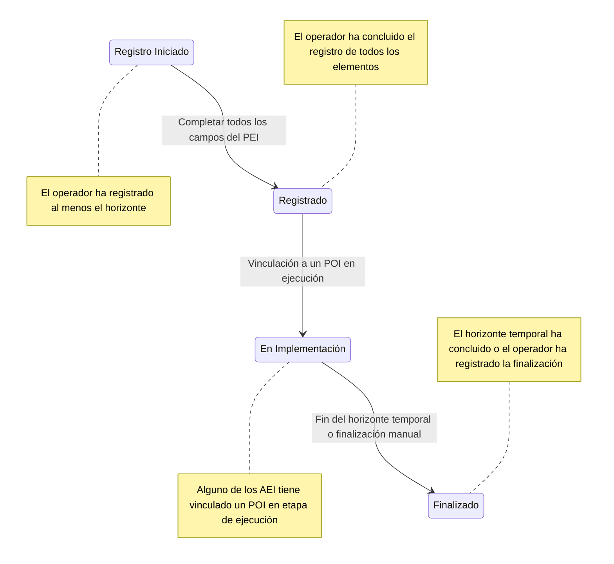

> Este documento presenta las funcionalidades para el proceso de [[Referencias#1. Formulación | Formulación]] del [[Referencias#5. Plan Estratégico Institucional (PEI). | PEI]]

## Descripción

Las funcionalidades de formulación deben permitir a los operadores de planeamiento el registro eficiente de los elementos del PEI, la gestión de su ciclo de vida, y la gestión de su implementación anual.

### Elementos del PEI:
-   **Nivel de Gobierno:** GN (Gobierno Nacional), GR (Gobierno Regional), GL (Gobierno Local).
-   **Sector o Territorio:** Define el ámbito de actuación.
-   **ID del PEI:** Identificador único del PEI. Ejemplos: 
	- `PEI-2022-2026` 
	- `PEI-2022-2026-Actualizado` 
	- `PEI-2022-2026-Ampliado-2027`
-   **Pliego:** Código y nombre del pliego al que pertenece.
-   **Tipo de Pliego:**
    -   Ministerio
    -   Organismo Constitucional Autónomo (OCA)
    -   Pliego Sectorial
    -   Gobierno Regional (GORE)
    -   Municipalidad Provincial
    -   Municipalidad Distrital
    -   Entidad Técnica Especializada (ETE)
    -   FONAFE
    -   Universidad
    -   Mancomunidad Regional
    -   Mancomunidad Local
-   **Misión del Pliego:** Declaración de misión de la entidad correspondiente.
-   **Horizonte Temporal:** Año de inicio y fin del PEI, por ejemplo, 2024-2027.
-   **Objetivos Estratégicos Institucionales (OEI):** Código y denominación.
-   **Acciones Estratégicas Institucionales (AEI):** Código y denominación.
-   **Matriz de Priorización:** Herramienta para señalar la importancia relativa de los elementos definidos  en el PEI.
-   **Articulación con Plan Superior:** Sección seleccionable que depende del tipo de pliego:
    -   **Ministerio:** PESEM => AES
    -   **OCA:** PEDN => AE o OE
    -   **Pliego Sectorial:** PESEM => AES
    -   **GORE:** PDRC => AER
    -   **Municipalidad Provincial:** PDLC => AEL
    -   **Municipalidad Distrital:** PDLC => AEL
    -   **ETE:** PDRC o PDLC => AER o AEP/AED
    -   **FONAFE:** PESEM => AES
    -   **Universidad:** PEDN => AE
    -   **Mancomunidad Regional:** PDRC => AER (de varias regiones)
    -   **Mancomunidad Local:** PDLC => AEP/AED (de varias provincias y distritos)
-   **Indicadores de OEI y AEI:** Variables clave para medir el éxito de los OEI y AEI.

### Elementos del Indicador del PEI:
-   **Objeto de Medición:** Selección entre OEI o AEI al que pertenece.
-   **Código y Denominación:** Identificador único y nombre del indicador.
-   **Justificación:** Explicación textual del motivo del indicador.
-   **Limitaciones:** Descripción de posibles limitaciones en párrafo textual.
-   **Responsable del Indicador:** Asignación de Unidades Ejecutoras (UE) y Centros de Costo (CC) del pliego.
-   **Método de Cálculo:** Descripción detallada con soporte para texto enriquecido y LaTex/MathML.
-   **Proceso de Recolección y Análisis:** Descripción detallada con soporte para texto enriquecido y LaTex/MathML.
-   **Relevancia:** Selección entre Muy relevante, Relevante y Poco relevante.
-   **Sentido Esperado:** Selección entre Ascendente, Descendente, o No definido.
-   **Tipo de Agregación:** Selección condicional:
    -   **Si "Sentido esperado" = Ascendente o Descendente:** Opciones: Agregable, No agregable.
    -   **Si "Sentido esperado" = No definido:** Opciones: Máximo permisible, Mínimo permisible.
-   **Línea de Base:** Año y valor inicial del indicador.
-   **Logro Esperado por Año:** Año y valor proyectado, donde "N" toma todos los años dentro del horizonte del PEI.

### Estados del Ciclo de Vida del PEI:
El ciclo de vida de un PEI comprende diferentes estados, cada uno representando una fase distinta del proceso de formulación e implementación.

-   **Registro Iniciado:**    
    -   **Descripción:** El operador ha registrado al menos el horizonte temporal del PEI, pero aún no ha completado el registro de todos los elementos.
    -   **Transición:** Pasa al estado "Registrado" una vez que todos los campos del PEI han sido completados.
    
-   **Registrado:**    
    -   **Descripción:** El operador ha completado el registro de todos los elementos del PEI y ha señalado la finalización del proceso de registro.
    -   **Transición:** Se pasa al estado "En Implementación" cuando alguno de los años del PEI se vincula a un POI en etapa de ejecución.
    
-   **En Implementación:**    
    -   **Descripción:** El PEI ha entrado en una fase activa de implementación. Esto ocurre cuando uno o más AEI están vinculados a un POI en ejecución.
    -   **Transición:** Se pasa al estado "Finalizado" cuando se cumple el horizonte temporal o cuando el operador registra manualmente la finalización del PEI.
    
-   **Finalizado:**    
    -   **Descripción:** El PEI ha completado su ciclo de vida, ya sea porque el horizonte temporal ha concluido o porque el operador ha registrado manualmente su finalización.

## Listado de Funcionalidades:

### 1. `MOD_PEI_F01` Gestión de Ciclo de Vida del PEI
Esta funcionalidad permite gestionar el ciclo de vida de los PEI de una entidad. Dependiendo de la necesidad, la entidad podrá realizar las siguientes acciones:

- **Registrar un PEI Nuevo:**
	- **Descripción:** Crear un nuevo PEI con un horizonte temporal completamente nuevo, lo que  implica el registro completo de sus componentes (OEI, AEI, indicadores, etc.).
	- **Implicancia en BBDD**: Se crea una nueva instancia de la entidad PEI en la base de datos. Se requiere el registro completo de todos los campos asociados
	- **ID:** `PEI-{Año inicio}-{Año fin}`, ejemplo: `PEI-2022-2026`.
	- **Transición de Estado:** El PEI pasa a "Registro Iniciado" tras completar los campos esenciales y luego a "Registrado" tras la finalización del registro.

-   **Actualizar el PEI Vigente:**    
    - **Descripción:** Actualizar un PEI vigente sin alterar su historia, para ello crear un nuevo PEI con el mismo horizonte del PEI vigente. Se hace una copia del PEI vigente y se permite la actualización de uno o más campos.
    - **Implicancia en BBDD**: Se crea una copia de instancia de la entidad PEI en la base de datos permitiendo actualizar, agregar o eliminar componentes. 
    - **ID:** `PEI-{Año inicio}-{Año fin}-Actualizado`, ejemplo: `PEI-2022-2026-Actualizado`.
    - **Transición de Estado:** El PEI actualizado sigue el ciclo de vida del PEI original, por tanto inicia su implementación luego del último año de evaluación del PEI base.
    
-   **Ampliar un PEI Vigente:**    
    - **Descripción:** Extender el horizonte temporal de un PEI vigente sin modificar el resto de los campos, asegurando la continuidad de las metas e indicadores.
    - **Implicancia en BBDD**: No se crea una nueva instancia de la entidad PEI en la base de datos, solo extiende los años de horizonte, habilitando el registro de valores esperados de indicadores en los años extendidos. 
    - **ID:** `PEI-{Año inicio}-{Año fin}-Ampliado-{año extendido}`, ejemplo: `PEI-2022-2026-Ampliado-2027`.
    - **Transición de Estado:** El PEI ampliado mantiene su estado de "En Implementación" o pasa de "Finalizado" a "Registrado" ( y luego a "En Implementación"), dependiendo de su fase al momento de la ampliación.
    

#### Listado de Historias de usuarios:
- [[MOD_PEI_F01_HU01_Habilitacion_de_registro]] Ceplan habilita el registro al operador
- [[MOD_PEI_F01_HU02_Registro_ID_PEI]] El operador selecciona el tipo de proceso (nuevo, actualización o ampliación de PEI). El sistema crea el ID del PEI y lo pasa al estado de "Registro Iniciado."
- [[MOD_PEI_F01_HU03_Registro_documento_PEI]] El operador registra el documento del PEI aprobado
- [[MOD_PEI_F01_HU04_Reporte_de_PEI_registrado]] El aplicativo genera el reporte del PEI en registro
- [[MOD_PEI_F01_HU05_Validacion_y_finalizacion_de_registro]] Ceplan valida que el registro y pasa al estado REGISTRADO al ID del PEI 

### 2. MOD_PEI_F02 Gestión de Objetivos Estratégicos Institucionales (OEI)
Esta funcionalidad permite registrar o actualizar los OEI en el PEI. Según el ciclo de vida del PEI, se podrá registrar un OEI nuevo o actualizar un OEI existente.
- **Registro de OEI (PEI Nuevo):** Permite la creación de nuevos OEI, incluyendo su denominación, tipo, y nivel de prioridad dentro del PEI.
- **Actualización de OEI (PEI Actualizado):** Permite la modificación de los datos de un OEI.
- **Ampliación de OEI (PEI Ampliado):** No permite modificaciones directas, pero se actualizan los logros esperados correspondientes al nuevo horizonte temporal.

#### Listado de Historias de usuarios:
- [[MOD_PEI_F02_HU01]]
- [[MOD_PEI_F02_HU02]]

### 3. MOD_PEI_F03 Gestión de Acciones Estratégicas Institucionales (AEI)
Esta funcionalidad permite registrar o actualizar las AEI en el PEI. Dependiendo del ciclo de vida del PEI, se puede registrar una nueva AEI o actualizar una existente.
- **Registro de AEI (PEI Nuevo):** Permite la creación de nuevas AEI asociadas a un OEI específico, incluyendo la denominación y nivel de prioridad.
- **Actualización de AEI (PEI Actualizado):** Permite la modificación de los datos de una AEI existente, garantizando su alineación con el OEI correspondiente.
- **Ampliación de AEI (PEI Ampliado):** No se permiten modificaciones directas, pero se pueden ajustar los logros esperados relacionadas con el nuevo horizonte temporal.

#### Listado de Historias de usuarios:
- [[MOD_PEI_F03_HU01]]
- [[MOD_PEI_F03_HU02]]

### 4. MOD_PEI_F04 Gestión de Indicadores
Esta funcionalidad permite registrar o actualizar los indicadores asociados a los OEI o AEI en el PEI. Dependiendo del ciclo de vida del PEI, se podrán registrar nuevos indicadores o actualizar los existentes.
- **Registro de Indicadores (PEI Nuevo):** Permite la creación de indicadores nuevos, incluyendo la selección del objeto de medición (OEI o AEI), denominación, responsable, justificación, limitaciones, método de cálculo, proceso de recolección y análisis, relevancia, sentido esperado, tipo de agregación, línea de base, y logro esperado para cada año.
- **Actualización de Indicadores (PEI Actualizado):** Permite agregar, eliminar o modificar un indicaodor. 
- **Ampliación de Indicadores (PEI Ampliado):** No se permiten modificaciones en los campos de los indicadores, pero se amplía los años de logros esperados y se deben registrar las metas para dichos años adicionales dentro del nuevo horizonte temporal.

#### Listado de Historias de usuarios:
- [[MOD_PEI_F04_HU01]]
- [[MOD_PEI_F04_HU02]]
