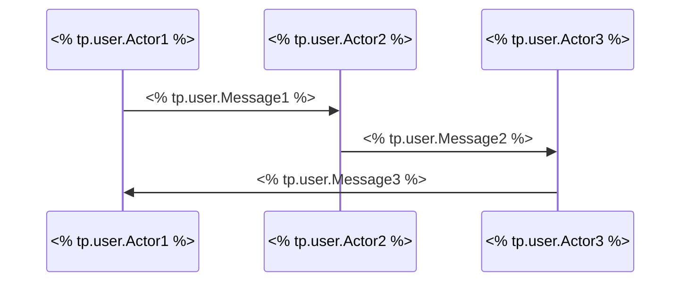

```mermaid
sequenceDiagram 
	participant A as <% tp.user.Actor1 %> 
	participant B as <% tp.user.Actor2 %> 
	participant C as <% tp.user.Actor3 %> 
	
	A->>B: <% tp.user.Message1 %> 
	B->>C: <% tp.user.Message2 %> 
	C->>A: <% tp.user.Message3 %>
```